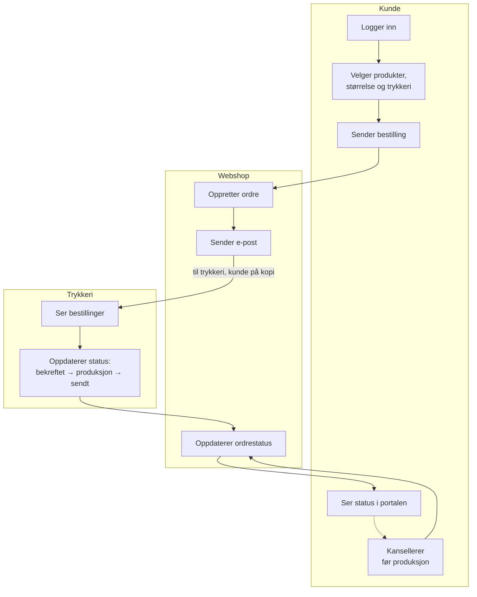
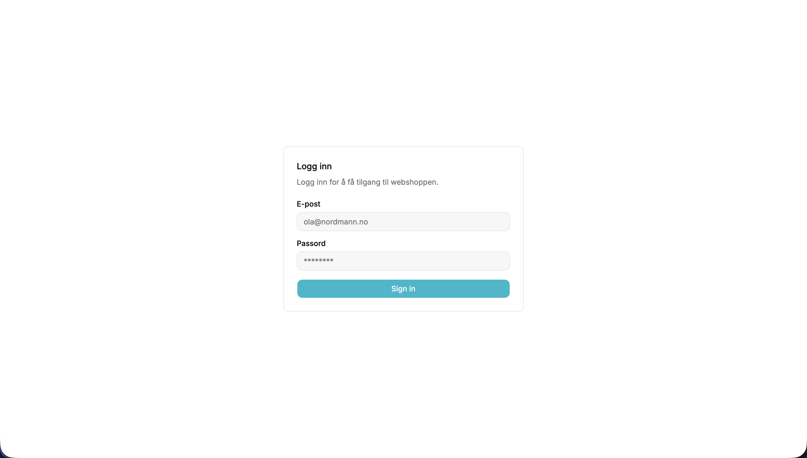
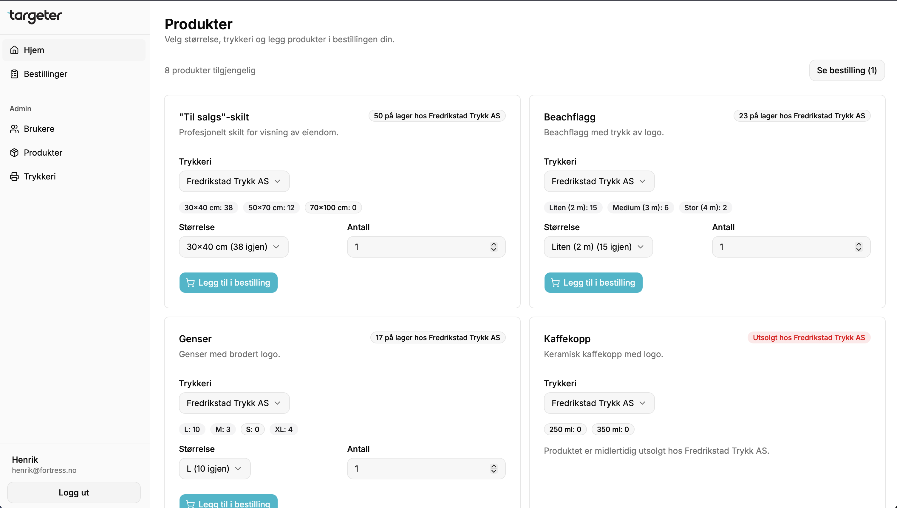
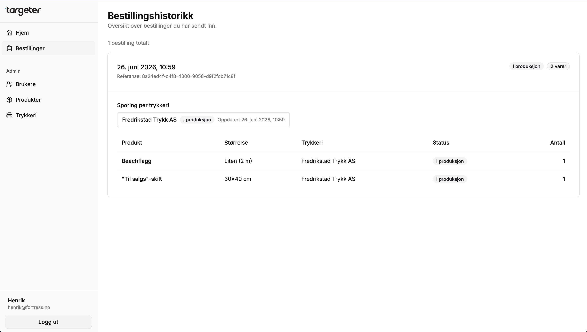

# Targeter Webshop

Bestillingsportal for trykkeriprodukter. Bygget med Next.js, Better Auth, Drizzle ORM og Resend.

## Formål

Targeter Webshop er lagd for å være et forenklet ledd mellom kunder og trykkerier. Det skal gjøre det raskt og oversiktlig å bestille artikler i ulike størrelser og fra ulike trykkerier. Alt håndteres av administratorbruker i grensesnittet.

Webshop-en er lagd som en del av Targeter-økosystemet.

Produksjonssiden er tilgjengelig på [webshop.targeter.tech](https://webshop.targeter.tech).

## Slik fungerer det

1. Kunden logger inn, velger produkter i den størrelsen og fra det trykkeriet de ønsker og bestiller
2. Bestilling opprettes og e-post går ut til trykkeriet med kunden på kopi
3. Trykkeriet kan gå inn i portalen og få en oversikt over bestillinger. De kan derfra oppdatere status, som å sette den til "bekreftet" og så videre til "i produksjon" eller "sendt"
4. Kunden ser oppdateringene i portalen under sine bestillinger og kan kansellere før trykkeriet har startet produksjon



## Brukertyper

Webshopen byr på tre ulike roller.

| Rolle      | Rettigheter                                                 |
| ---------- | ----------------------------------------------------------- |
| user       | Se og bestille produkter                                    |
| print_shop | Se bestillinger til sitt trykkeri                           |
| admin      | Redigering av produkter, trykkerier, brukere og lagerstatus |

## Tech-stack

| Lag             | Teknologi                                 |
| --------------- | ----------------------------------------- |
| Frontend        | Next.js 16, React 19, Tailwind, shadcn/ui |
| Autentisering   | Better Auth                               |
| Database        | PostgreSQL gjennom Drizzle ORM            |
| E-post          | Resend                                    |
| Package manager | Bun                                       |
| Deployment      | Vercel                                    |

## Datamodell

Schema definert i [lib/db/schema.ts](lib/db/schema.ts), oversikt:

- Auth: user, session, account, verification
- Katalog: product, product_size, product_size_stock (lager per trykkeri)
- Bestilling: order, order_item (trykkeri per varelinje)
- Oppfølging: order_fulfillment (status per trykkeri per ordre)
- Partnere: print_shop

## Ordersyklus

Statuser er definert i [lib/order-fulfillment/status.ts](lib/order-fulfillment/status.ts), og ser slik ut:

```
pending → sent → confirmed → in_production → shipped → delivered
```

- Kunde kan kansellere frem til in_production
- Trykkeri kan kansellere når som helst

## E-poster

Oppsett med Resend, avsender og API-nøkkel definert i .env.

- Ny bestilling: til trykkerikontakt og kunde som kopi med referansekode; FULFILLMENT:<uuid>
- Statusoppdatering: Sendes til kunden og trykkerikontakt ved endring eller kansellering fra hver av partene

## Skjermbilder

### Login



### Produkter



### Bestillinger



## Kjør lokalt

```bash
bun install
cp .env.example .env
bun dev
```

Følgende environment variables kreves:

- DATABASE_URL Neon PostgreSQL connection string
- RESEND_API_KEY Resend API-nøkkel
- RESEND_FROM Avsenderadresse inkl. navn (f.eks. Targeter Webshop <webshop@targeter.tech>)

Åpne [http://localhost:3000](http://localhost:3000) i nettleseren.

## Drift

Appen er prodsatt hos [Vercel](https://vercel.com) og har database hos [Neon](https://neon.tech).

## Designvalg

Appen skal være en lukket, betalingsfri bestillingsportal, tiltenkt eiendomsmeglerkunder, som skal erstatte manuelle prosesser for fysiske trykkeriartikler. Eksterne integrasjoner utelatt men planlagt i framtiden, for innhenting av generert materiale eller SSO-løsninger. Løsningen benytter seg av moderne og open source biblioteker, dette for å fokusere utviklingstiden på kjernefunksjonalitet.

## Testbrukere

Ligger tilgjengelig for demo på prod-siden i [demo.md](docs/demo.md)

## Utviklingslogg

Følgende er logger fra utviklingen:

- [Dag 1](docs/logs/dag-1.md)
- [Dag 2](docs/logs/dag-2.md)
- [Dag 3](docs/logs/dag-3.md)
- [Dag 4](docs/logs/dag-4.md)
